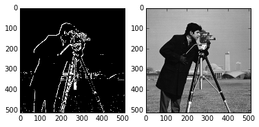
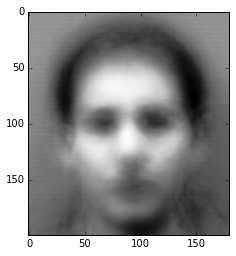
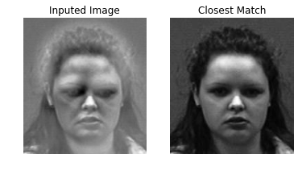

# Derek Miller: Portfolio

I turn business problems into math problems and solve them with code. My background is in math, computer science, statistics, and economics. I am particularly interested in the intersection of machine learning, data visualization, and user experience design.

## Introduction

This repository contains a small sample of projects I have worked on for companies, as a student in Applied and Computational Mathematics, and for fun. In certain cases, the code in each folder has been modified to protect company information.

Some examples:
* image recognition via eigenfaces
* calculating customer lifetime value
* maximizing profit and minimizing cost for customer visits
* finding your seat on an airplane

Libraries used: numpy, scipy, pandas, sklearn, networkx, pyodbc, matplotlib, matplotlib's Basemap, geopy, lifetimes, ...

# Examples

```python
# import statements
import tools as t
import numpy as np
from matplotlib import pyplot as plt
%matplotlib inline
```

## Recommender System

One way to recommend products to customers is to look at what other similar customers bought.

A simple way quantify similarity is to create a vector of features. This can be represented as a list of zeros and ones. Given a list of products, the corresponding number in the list will be either a one if the customer bought that product or a zero otherwise. The normalized dot product of two vectors produces a number between 0 and 1 called the cosine similarity. This estimates the similarity between two customers with 0 being no similarity and 1 being identical.

Using this similarity, a product can be scored based on how many similar customers bought that product compared to a different customer. Recommend the products that the customer hasn't bought that have the highest scores.

```python
# dictionary converts customer id to customer name
to_name = t.make_to_name()

R = t.recommender('../data/PTTPARTS.csv')
R.similarity_matrix(transpose=True)
print(to_name['1057']+' is similar to...\n')
for i in R.similar_to(1057)[:15]:
    name = to_name[R.from_index[i[0]]]
    if t.use(name):
        print(name,i[1])
```

    Oregon Freeze Dry Foods is similar to...
    
    ('Aveda Corporation', 0.38346821065500492)
    ('Colgate Palmolive Tech Center', 0.36245699167329504)
    ('Novo Nordisk', 0.32069443135208864)
    ('Allied Old English, Inc.', 0.24309684249639285)
    ('North Carolina State Universit', 0.23108408032649064)
    ('Carolina Foods Inc', 0.21473892259683336)
    ('Quali Tech Inc', 0.21118547093938189)
    ('Labomar d.o.o.', 0.19427937057310141)
    ('The Jerky Shoppe', 0.18108065446288402)
    ('G & G Enterprises Inc', 0.17402004840930574)
    ('Bimbo Bakeries USA', 0.17393181644453315)
    ('Lightlife Foods', 0.16918824204598992)


```python
print R.recommend(1057)[:,0]
```

    ['Pawkit' 'AquaLab Lite' 'AquaLab S4TEV' 'AquaLab Trade-In' 'AquaLab Pre'
     'Pawkit 2' 'AquaLab S3' 'AquaLab 4 Dew' 'AquaLink' 'Refurbished AquaLab']


## Marketing Strategy

Trying to sell a new product to old customers can be thought of as a Multi-Armed Bandit problem. For example, suppose a company has three types customers. The company has invested a lot of money in developing a new product and only wants to market the product to the type of customer that has the highest probability of buying it. 

Initially, the company does not know which type of customer is the most likely to buy, so it has to balance two different objectives. The first objective is to market to each of the different types of customers to find out who is most likely to buy; this is called exploration. The second objective is to market to the type of customer most likely to buy; this is called exploitation. The company wants to optimize the exploration-exploitation dilemma. A technique known as Thompson Sampling uses the statistical beta distribution and Bayes theorem to solve this problem.

```python
t.testMAB(3,[.3,.5,.7],[.3,.5,.7],niters=80)
```


## Market Segmentation

One method of customer segmentation relies on feature vectors and graph theory models. 

Using the same features described above in the product recommendation section, the network of customers can be represented as a matrix where the similarity between customers forms a weak or strong connection, depending on the cosine similarity.

The Markov Clustering Algorithm breaks down weak connections between companies and identifies clusters of similar customers. This effectively segments the market as demonstrated below.

```python
R = t.recommender('../data/example.csv')
R.similarity_matrix()
G2 = t.nx.Graph(R.D)
t.nx.draw_networkx(G2)
```


```python
cust_clusters = t.markov_cluster_algorithm(R.D,2,2)
G = t.nx.Graph(cust_clusters)
t.nx.draw_networkx(G)
```


## Customer Lifetime Value

Marketing to the right customers depends on the ability to find out who our most valuable customers are.

Customer Lifetime Value (CLV) is the total amount of expected, time-discounted revenue of a customer until they are no longer a customer. There are several ways of estimating this amount. One method relies on modeling customer behavior in aggregate using statistical distributions. The implementation below uses a variant of the Pareto-NBD model from *"Counting Your Customers" the Easy Way: An Alternative to the Pareto/NBD Model* by Fader, et al using the lifetimes module at github.com/CamDavidsonPilon/lifetimes.


```python
C = t.CLV()
C.get_data_from_file('../data/pmg01.csv')
C.fit()
```


```python
print(C.results[:5])
```

           frequency  recency     T  monetary_value  predicted_purchases  \
    id                                                                     
    36413       40.0     78.0  81.0    9.267299e+06            43.297793   
    48379       13.0     22.0  24.0    9.234662e+03            39.999265   
    4017        47.0     93.0  96.0    8.108095e+03            43.498003   
    9946         2.0     32.0  44.0    6.468293e+04             4.656563   
    4885        76.0     94.0  96.0    3.906934e+03            70.049703   
    
           predicted_trans_profit  clv_estimation  prob_alive  
    id                                                         
    36413            9.262273e+06    4.010360e+08    0.997020  
    48379            9.223589e+03    3.689368e+05    0.994689  
    4017             8.105548e+03    3.525752e+05    0.997455  
    9946             6.401612e+04    2.980951e+05    0.978090  
    4885             3.906559e+03    2.736533e+05    0.998260  


## Visualizing Customer Locations

Using the `Geocode` object in `tools.py`, we can convert customer addresses into GPS coordinates.
We can segment our customers by area and find area hubs. The area hubs in this image were calculated with Mean Shift clustering.
Then we can further segment customers by CLV, market, or other features.


## School Projects

*Sobel Filter*

As a student, I learned edge detection using the Sobel Operator. This method uses an approximation of the derivative at each location to detect large changes in a grayscale version of a picture. This works well on images that already have high contrast. The resulting image below comes from a picture taken of a cameraman.





*Eigenfaces*

These pictures come from a data set of pictures of faces. Facial features can be represented as eigenvectors of a matrix representation of the pictures. Using the Singular Value Decomposition of the mean adjusted collection of faces, unique facial features can be detected. Each face is a unique combination of these facial features. Given a new image of a face, the algorithm finds the closest matching image with the right combination of facial features. This algorithm performs relatively well despite its simplicity.

The images below are representations of the average face of the data set and a mean-adjusted face of an individual person.







Also check out a collaborative data visualization of Classic Literature at https://www.behance.net/thesarahkay where I helped with data cleaning.
