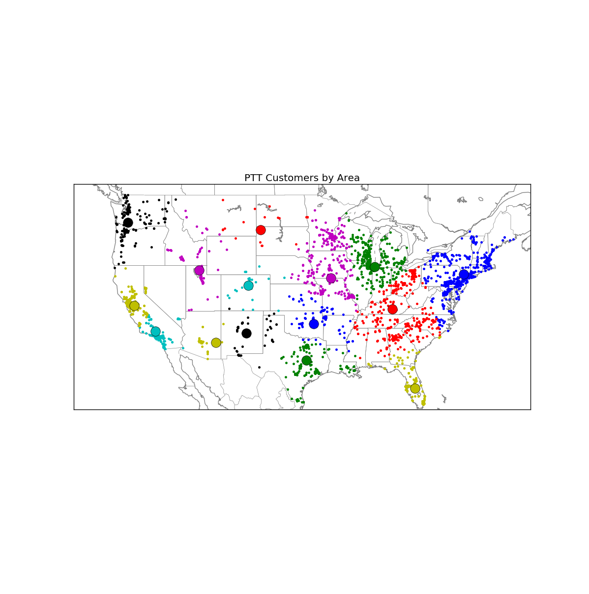
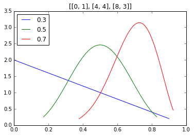
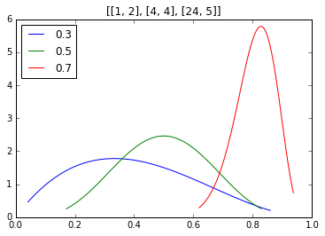
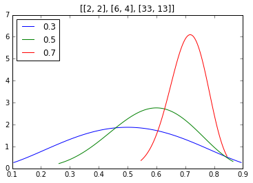
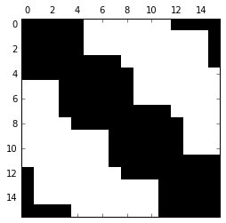
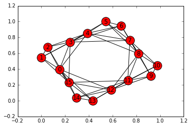
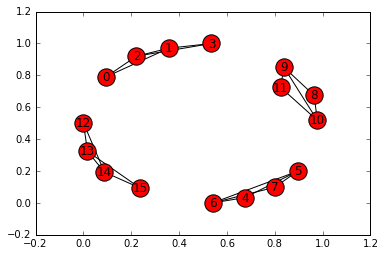

# Derek Miller: Portfolio

I turn business problems into math problems and solve them with code.




## Introduction

This repository contains some of my work in Applied and Computational Mathematics, summer internships, and side projects.

Some examples:
* image recognition via eigenfaces
* calculating customer lifetime value
* maximizing profit and minimizing cost for customer visits
* finding your seat on an airplane

Libraries used: numpy, scipy, pandas, sklearn, networkx, pyodbc, matplotlib, matplotlib's Basemap, geopy, lifetimes, ...


```python
# import statements
import tools as t
import numpy as np
from matplotlib import pyplot as plt
%matplotlib inline
```

## Recommender System

One way to recommend products to customers is to look at what other similar customers bought. In this case, we define similarity to be the cosine similarity of two feature vectors. Using `data/example.csv`, we can generate recommendations for customers based on their previous purchases.


```python
# dictionary converts customer id to customer name
to_name = t.make_to_name()

R = t.recommender('../data/PTTPARTS.csv')
R.similarity_matrix(transpose=True)
```

    start time
    Wed Aug 17 10:27:47 2016
    computing...
    0.0
    finished in 0 seconds


```python
print(to_name['1057']+' is similar to...\n')
for i in R.similar_to(1057)[:15]:
    name = to_name[R.from_index[i[0]]]
    if t.use(name):
        print(name,i[1])
```

    Oregon Freeze Dry Foods is similar to...
    
    ('Aveda Corporation', 0.38346821065500492)
    ('Colgate Palmolive Tech Center', 0.36245699167329504)
    ('Novo Nordisk', 0.32069443135208864)
    ('Allied Old English, Inc.', 0.24309684249639285)
    ('North Carolina State Universit', 0.23108408032649064)
    ('Carolina Foods Inc', 0.21473892259683336)
    ('Quali Tech Inc', 0.21118547093938189)
    ('Labomar d.o.o.', 0.19427937057310141)
    ('The Jerky Shoppe', 0.18108065446288402)
    ('G & G Enterprises Inc', 0.17402004840930574)
    ('Bimbo Bakeries USA', 0.17393181644453315)
    ('Lightlife Foods', 0.16918824204598992)


```python
print R.recommend(1057)[:,0]
```

    ['Pawkit' 'AquaLab Lite' 'AquaLab S4TEV' 'AquaLab Trade-In' 'AquaLab Pre'
     'Pawkit 2' 'AquaLab S3' 'AquaLab 4 Dew' 'AquaLink' 'Refurbished AquaLab']


## Marketing Strategy

Trying to sell a new product to old customers can be thought of as a Multi-Armed Bandit problem. We can solve our dilemma using Thompson Sampling. Each curve below represents what we think the payout probability of a bandit is. The height represents how strong we believe that this is the actual average of the bandit payout. The graphs are printed starting at iteration 0 and every 20 iterations after that.


```python
t.testMAB(3,[.3,.5,.7],[.3,.5,.7],niters=80)
```











## Market Segmentation

One method of customer segmentation relies on feature vectors and graph theory models. We can construct a representation of a graph by using the similarity matrix already computed in the recommender object. Then we can use Markov Clustering to find the groups that are most connected.

Suppose that someone opens up a bar in town called the Biz-R Bar and it has 16 regular customers. The drinks offered at the Biz-R Bar are (in alphabetical order) beer, energy drinks, juice, lemonade, milk, soda, water, and wine. For each visit, the bartender collected data on which drinks each customer ordered and put them in the file `data/example.csv`. The bartender would like to know if there are certain types of people who order certain things, or if it's all just random.


```python
R = t.recommender('../data/example.csv')
R.similarity_matrix()
```

    start time
    Wed Aug 17 10:27:50 2016
    computing...
    0.0
    finished in 0 seconds


```python
plt.spy(R.D)
plt.show()
G2 = t.nx.Graph(R.D)
t.nx.draw_networkx(G2)
```








```python
cust_clusters = t.markov_cluster_algorithm(R.D,2,2)
```

    0
    25
    50
    75


```python
plt.spy(cust_clusters)
plt.show()
```


```python
G = t.nx.Graph(cust_clusters)
```


```python
t.nx.draw_networkx(G)
```





## Customer Lifetime Value

Marketing to the right customers means we should try to figure out who our most valuable customers are so that we can focus our limited resources on the customers who are most worth the investment. The clv object pulls data from the sales database and predicts average purchase behavior of each customer over a specified time period using a statistical model detailed in *"Counting Your Customers" the Easy Way: An Alternative to the Pareto/NBD Model* by Fader, et al. This is implemented via the lifetimes module at github.com/CamDavidsonPilon/lifetimes.


```python
C = t.CLV()
C.get_data_from_file('../data/pmg01.csv')
C.fit()
```


```python
print(C.results[:5])
```

           frequency  recency     T  monetary_value  predicted_purchases  \
    id                                                                     
    36413       40.0     78.0  81.0    9.267299e+06            43.297793   
    48379       13.0     22.0  24.0    9.234662e+03            39.999265   
    4017        47.0     93.0  96.0    8.108095e+03            43.498003   
    9946         2.0     32.0  44.0    6.468293e+04             4.656563   
    4885        76.0     94.0  96.0    3.906934e+03            70.049703   
    
           predicted_trans_profit  clv_estimation  prob_alive  
    id                                                         
    36413            9.262273e+06    4.010360e+08    0.997020  
    48379            9.223589e+03    3.689368e+05    0.994689  
    4017             8.105548e+03    3.525752e+05    0.997455  
    9946             6.401612e+04    2.980951e+05    0.978090  
    4885             3.906559e+03    2.736533e+05    0.998260  


## Visualizing Customer Locations

Using the `Geocode` object in `tools.py`, we can convert customer addresses into GPS coordinates. Once we have the coordinates, we can visualize customers by their CLV and geographic location. The brightness or intensity of color on the a dark background represents high CLV and less brightness indicates low clv. A good example of a map is found in `images_graphs/darkmap_clv.png`.

Suppose we wanted to expand Decagon by relocating sales representatives to 10 key cities around the United States. We need to place them in such a way as to minimize the distance to nearby customers. This can be found out using k-means clustering on the gps coordinates, as shown below. The large grey dots represent general areas that we should consider placing our sales reps.


```python
N = t.Nightmap()
```

    clv for area:
    436226858.761


```python
N.nightplot()
```


```python
N.worldplot(kmeans=12)
```


Also check out a collaborative data visualization of Classic Literature at https://www.behance.net/thesarahkay where I helped with data cleaning.
